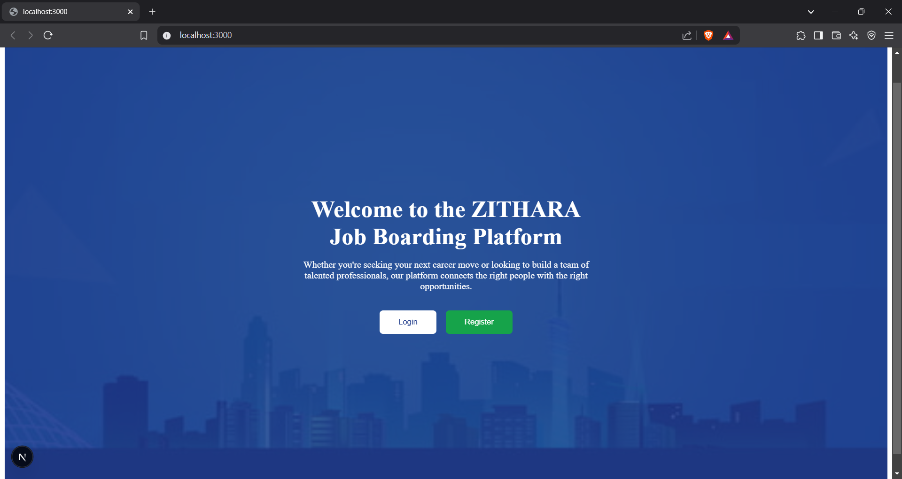
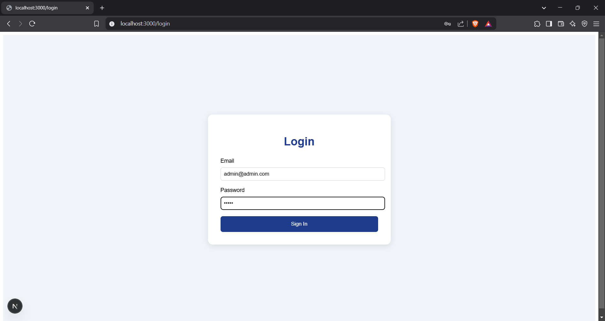
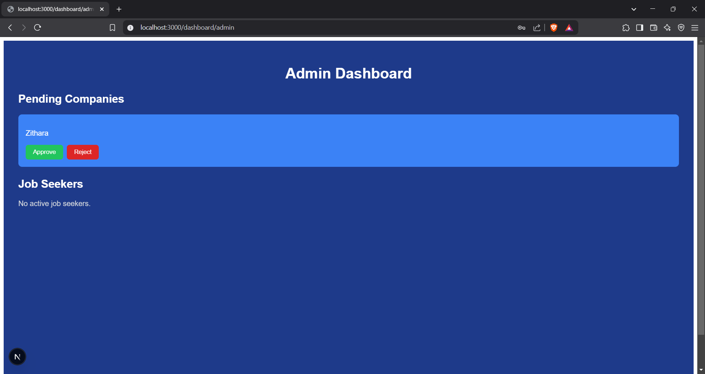
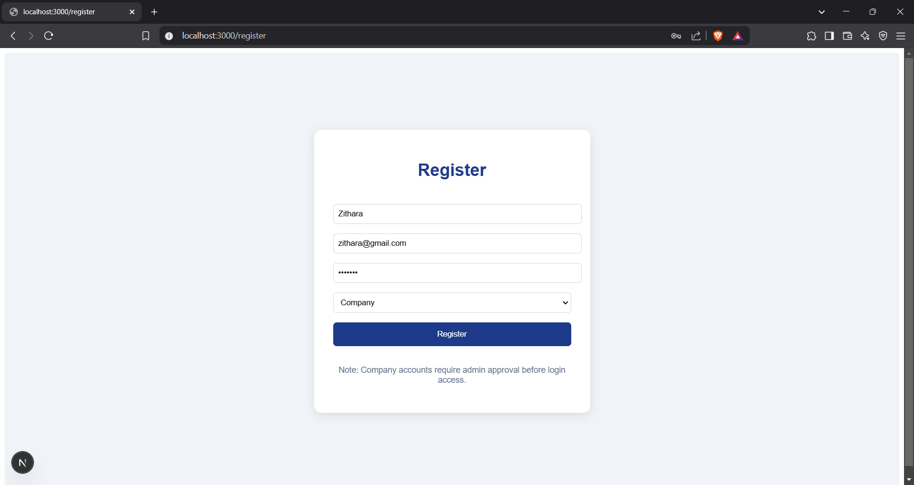
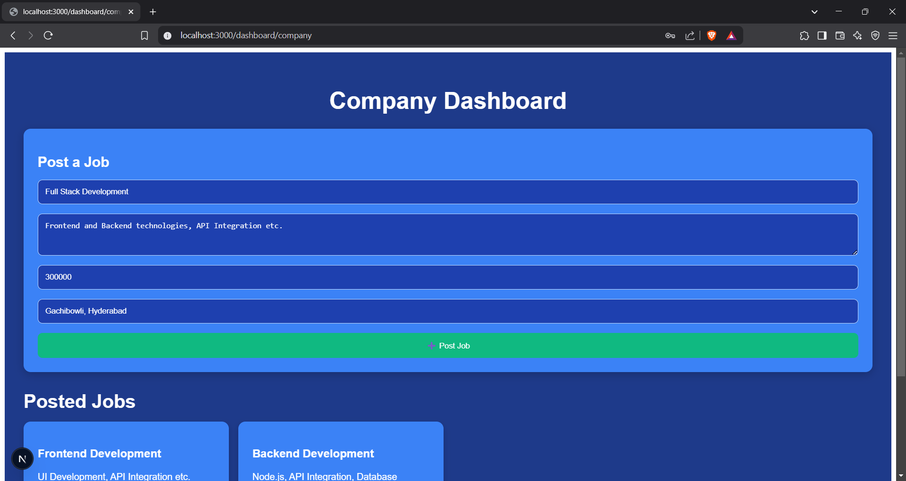
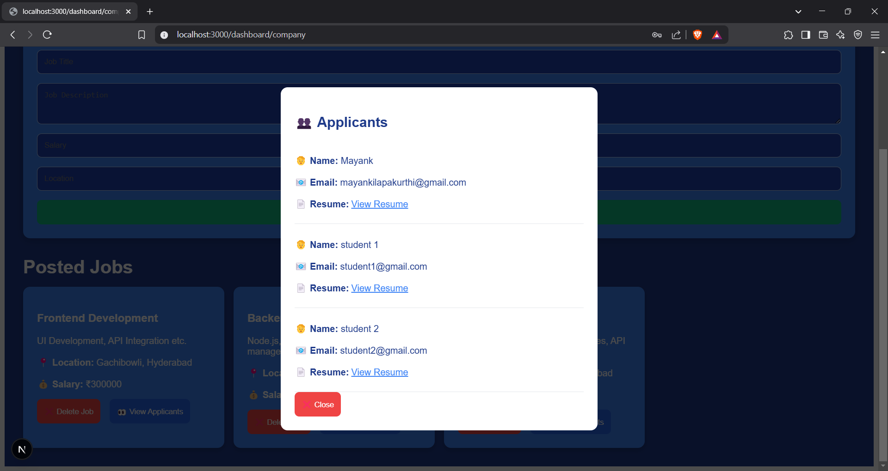
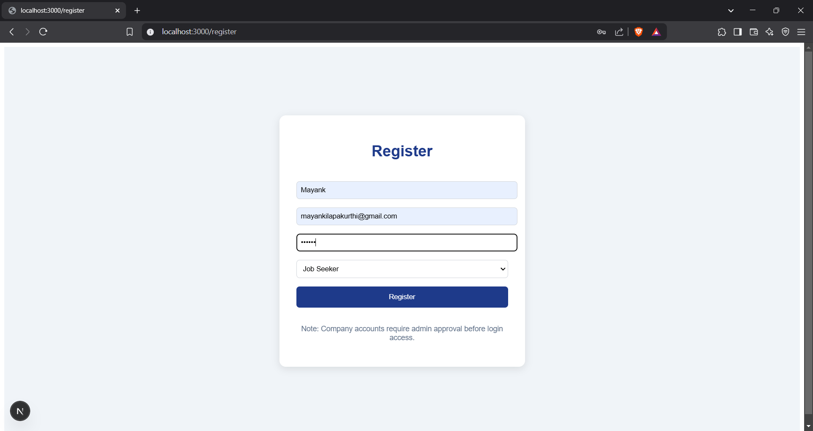
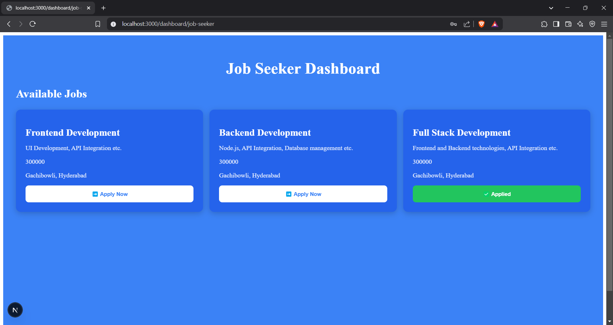

# **Zithara Job Boarding Platform**

## **Overview**
**Zithara** is a modern job board platform designed to simplify the hiring process for companies while empowering job seekers to explore career opportunities. Inspired by platforms like **LinkedIn** and **Internshala**, Zithara provides a seamless experience for admins, companies, and job seekers through robust **role-based authentication**.

The platform emphasizes clarity, efficiency, and scalability, with potential enhancements planned for future development.

---

## **Tech Stack**
Zithara leverages the following technologies to ensure performance, scalability, and security:  

- **Next.js** — Frontend framework for fast, server-rendered UI.  
- **Node.js** — Backend for handling API requests and business logic.  
- **MongoDB** — NoSQL database for flexible data storage.  
- **JWT/NextAuth** — Authentication system to manage user roles securely.  

---

## **Workflow Overview**

Here’s a step-by-step visual guide to the platform's core functionality:
### **🔹Home**
  Home screen for all users.  
   

### **🔹 Admin Workflow**
1. **Admin Login**  
   Admin securely logs in to the platform to access the management dashboard.  
   

2. **Approving or Rejecting Companies**  
   Admin reviews company registration requests and approves or rejects them based on criteria.  
   

---

### **🔹 Company Workflow**
1. **Company Registration**  
   Companies sign up on the platform and await admin approval.  
   

2. **Posting Jobs**  
   Once approved, companies can post job listings and update them as needed.  
   

3. **Viewing Job Applicants**  
   Companies can view applicants for posted jobs and contact them directly via email.  
   

4. **Deleting Jobs**  
   Companies can delete job listings if necessary.  
   

---

### **🔹 Job Seeker Workflow**
1. **Job Seeker Registration**  
   Job seekers can sign up directly on the platform.  
   

2. **Applying for Jobs**  
   After registration, job seekers can browse available jobs and apply for roles of interest.  
   

3. **Waiting for Mail Contact**  
   Job seekers wait for an email notification once their application has been reviewed or updated.  
   

---

This section now uses the screenshots you have and details the workflow for each role in the platform. Simply replace the image names and file paths with your actual filenames. Let me know if this works for you!

## **Key Features**
Zithara follows a structured, role-based system to ensure controlled access and streamlined interactions:

### **🔹 Admin Role**
- Logs in to manage the platform's operations.  
- Approves company registrations before they can post job listings.  
- Monitors user activity and blocks accounts that violate platform policies.  

### **🔹 Company Role**
- Registers on the platform and awaits admin approval.  
- Posts, updates, and deletes job listings.  
- Views job applications and contacts applicants directly via email.  

### **🔹 Job Seeker Role**
- Registers and logs in directly.  
- Applies for job listings from approved companies.  
- Waits for application updates via email notifications.  

---

## **Project Vision**
While Zithara's current build emphasizes a clean and efficient platform, the following features are envisioned for future development:  

✅ **AI Resume Scanner:** Provides personalized role suggestions by analyzing uploaded resumes.  
✅ **In-App Communication System:** Enables seamless interaction between companies and job seekers.  
✅ **Professional Guidance Hub:** Offers AI-powered mock interviews, expert tips, and career-building strategies.  

---
